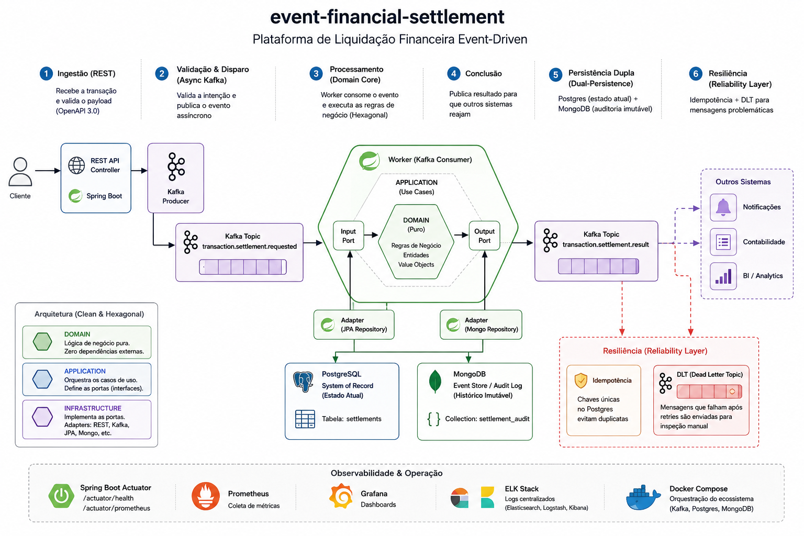

# event-financial-settlement 
[](https://www.oracle.com/java/technologies/javase/jdk21-archive-downloads.html)
[](https://spring.io/projects/spring-boot)
[](https://opensource.org/licenses/MIT)

**Plataforma de Liquidação Financeira Event-Driven** - Um showcase de como utilizar ecossistemas Java modernos, arquitetura distribuída e resiliência.

---

##  Visão Geral
O `event-financial-settlement` 
 é um **Motor de Compensação e Liquidação (Clearing & Settlement Engine)**. 

Em sistemas financeiros, a liquidação é o processo onde a obrigação de pagar é cumprida. Este sistema gerencia o ciclo de vida completo dessa obrigação, garantindo que, em um ambiente distribuído, uma transação seja processada exatamente uma vez (idempotência), auditada de forma imutável e que falhas sejam tratadas sem perda de dados.

##  Ciclo de Vida da Transação (Data Flow)

O sistema opera através de 6 estágios críticos para garantir a integridade financeira:

1.  **Ingestão (REST)**: Porta de entrada onde a transação é recebida. Aqui ocorre a validação sintática estrita baseada no contrato OpenAPI 3.0.
2.  **Validação & Disparo (Async Kafka)**: Para garantir baixa latência na resposta ao cliente, o sistema apenas valida a intenção e dispara um evento `TransactionSettlementRequested`. O processamento pesado é desacoplado.
3.  **Processamento (Domain Core)**: O worker consome o evento e executa as regras de negócio. Onde com a **Arquitetura Hexagonal** a lógica de liquidação fica isolada no `domain/`, protegida de efeitos colaterais de infraestrutura.
4.  **Conclusão**: Após o processamento, um evento de sucesso (`Completed`) ou erro (`Failed`) é publicado para que outros sistemas (como Notificações ou Contabilidade) possam reagir.
5.  **Persistência Dupla (Dual-Persistence Strategy)**:
    *   **PostgreSQL**: Atua como o *System of Record*, mantendo o estado atual da liquidação.
    *   **MongoDB**: Atua como um *Event Store/Audit Log*, registrando cada mudança de estado para fins de auditoria e rastreabilidade histórica.
6.  **Resiliência (Reliability Layer)**:
    *   **Idempotência**: Uso de chaves únicas no banco para ignorar mensagens duplicadas do Kafka.
    *   **DLT (Dead Letter Topic)**: Mensagens que falham após retries são movidas para uma fila de inspeção manual, evitando o bloqueio do pipeline.

---

##  Estrutura e Mapeamento Arquitetural



O código está organizado seguindo rigorosamente os princípios de **Clean Architecture** e **Hexagonal Architecture**:

| Camada | Pacote | Responsabilidade |
| :--- | :--- | :--- |
| **Domain** | `domain.model` | Entidades, Value Objects (`records`) e Lógica de Negócio pura. **Zero dependências externas.** |
| **Application** | `application.usecase` | Orquestração do fluxo. Define as interfaces (Ports) de entrada e saída. |
| **Infrastructure** | `infrastructure.adapter` | Implementações reais: Spring Controllers (REST), Kafka Listeners, JPA/Mongo Repositories. |

---

##  Tech Stack & Decisões Técnicas (ADRs)

*   **Java 21 Virtual Threads**: Implementado para suportar alta concorrência em operações de I/O (Kafka/DB) com baixo consumo de memória.
*   **Spring Boot 3.3.x**: Base do ecossistema, configurado com foco em modularidade.
*   **Apache Kafka (KRaft)**: Backbone de mensageria para processamento assíncrono e resiliente.
*   **Testcontainers**: Utilizado para garantir que os testes de integração rodem contra instâncias reais de Kafka e Bancos, eliminando o "funciona na minha máquina".

---

## 🚀 Como Começar

### Pré-requisitos
- Docker & Docker Compose
- JDK 21+

### 1. Inicie o Ecossistema
```bash
docker-compose up -d
```
*Isso subirá PostgreSQL, MongoDB e Kafka (KRaft).*

### 2. Execute a Aplicação
```bash
# No Windows:
mvnw.cmd spring-boot:run

# No Linux/macOS:
./mvnw spring-boot:run
```

### 3. Estratégia de Testes
O projeto segue a pirâmide de testes:
- **Testes Unitários:** Lógica de negócio na camada de `domain`.
- **Testes de Integração:** Fluxo de ponta a ponta usando **Testcontainers** para subir instâncias reais de Kafka, Postgres e Mongo durante o build.

Para rodar todos os testes:
```bash
./mvnw test
```

### 3.1 Simule uma Liquidação
Envie uma requisição via cURL (Exemplo para PowerShell):
```powershell
curl -X POST http://localhost:8080/v1/transactions/settlement `
-H "Content-Type: application/json" `
-d '{
  "transactionId": "'$([guid]::NewGuid().ToString())'",
  "amount": 100.00,
  "currency": "BRL",
  "merchantId": "7c9e66ab-ad65-4a7b-9443-442255441111",
  "customerId": "123e4567-e89b-12d3-a456-426614174000",
  "timestamp": "2024-03-20T15:30:00Z"
}'
```

### Exemplo de Resposta
```json
{
  "status": "ACCEPTED",
  "message": "Transaction settlement is being processed.",
  "correlationId": "550e8400-e29b-41d4-a716-446655440000"
}
```

### 4. O que observar:
*   **Logs**: Veja o Worker processando a mensagem do Kafka e persistindo nos bancos.
*   **Postgres**: Verifique a tabela `settlements` (estado final).
*   **MongoDB**: Verifique a collection `settlement_audit` (histórico completo).
*   **Testes**: Execute `./mvnw test` e observe o Testcontainers subindo a infra real para o teste E2E.

---
Desenvolvido por [Eduardo Ponciano](https://github.com/eduardoPonciano)
